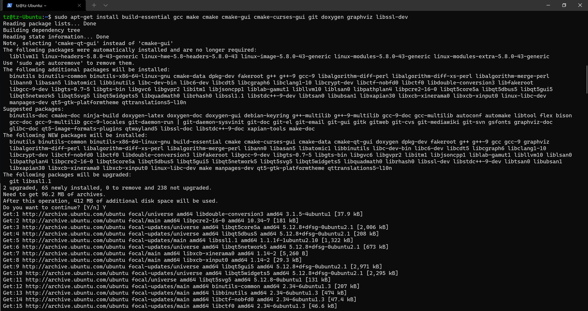

# Use Paho-C client to connect Azure IoT Hub without C-SDK

This article explains how to use Paho-C mqtt client to connect Azure IoT Hub.

## 1. Background

Azure IoT Hub support MQTT direct connection for those constrained devices. Microsoft provided a sample using **mosquitto c client** to connect Azure IoT Hub using MQTT direct. Some customers are using **Paho-C client** and are looking for a guidance to do that. I created this for their reference.

## 2. Development environment

Here is my development environment. You may use 
- Dev PC: Intel NUC. You may use any PC or even a VM.
- OS: **Ubuntu 20.04 LTS**. Any Linux distros should work.
- Azure susbscription: **required**.
- Azure IoT Hub: **required**.
- Github access: **required**.
- Text editor: You may use any text editor like nano, gedit or vi.
- Azure IoT Explorer: **required**.


## 3. Set up environment

## 3.1 Install necessary dependencies and packages

Run below command on Ubuntu bash.

```
sudo apt update
sudo apt-get install build-essential gcc make cmake cmake-gui cmake-curses-gui git doxygen graphviz libssl-dev
```




## 3.2 Download the paho mqtt client

```
git clone https://github.com/eclipse/paho.mqtt.c.git
cd paho.mqtt.c
ls
```


## 3.3 Build the source

```
sudo make clean  # This is optional for new build
sudo make all
sudo ldconfig
```

## 4. Modify the source codes

Use the sample code and start to modify.

```
cd ~/paho.mqtt.c/src/samples/
cp MQTTAsync_publish.c MQTTAsync_pub_tz.c
nano MQTTAsync_pub_tz.c
```

In the source, below part need to be updated.

### 4.1 Add MQTT connection info

```
#define ADDRESS     "ssl://{your iothub name}.azure-devices.net:8883"
#define CLIENTID    "{your deviceId}" 
#define TOPIC       "devices/{your deviceId}/messages/events/" 
#define PAYLOAD     "Hello, greetings from Tim!"
```

### 4.2 Add IoT Hub username and password

```
// IoT Hub username and password
conn_opts.username = "{your iothub name}.azure-devices.net/paho-tz/?api-version=2018-06-30";
conn_opts.password = "SharedAccessSignature sr=iothub-0507.azure-devices.net%2Fdevices%2Fpaho-tz&sig=ieuyD**********************36";
```

### 4.3 Use IoT Hub Root CA

```
// Use IoT Hub Root CA - Baltimore
conn_opts.ssl = &sslopts;
conn_opts.ssl->trustStore = "/etc/ssl/certs/iothub-ca.crt";
```


## 5. Add IoT Hub CA certificate

You may find the IoT Hub CA Baltimore certficate from [here](https://github.com/Azure/azure-iot-sdk-c/blob/master/certs/certs.c). Save this certificate to local folder `~/Documents/` as a file called `iothub-ca.crt`, then copy it to `/etc/ssl/certs`.

```
sudo cp ~/Documents/iothub-ca.crt /etc/ssl/certs/

```


## 6. Compile the code

Follow below command.

```
gcc ./MQTTAsync_pub_tz.c -lpaho-mqtt3as -o mqtt_tz_client

```

## 7. Run the file
Use below command to run the code.

```
./mqtt_tz_client
```


## 8. Verify the result

You may use the `Azure IoT Explorer` to verify the data received on IoT Hub.


You may find the sample source codes from [](sources/)

`THE END`


